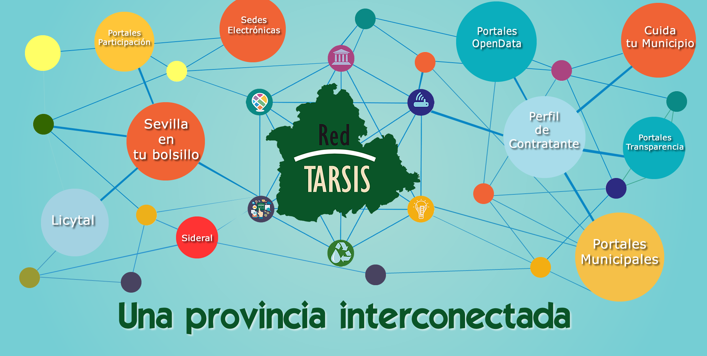

[Volver al índice general](../README.md)

# UD1 – Análisis del entorno y detección de necesidades tecnológicas

## Índice de apartados

- [ ] **1. Análisis del sector tecnológico**
- [ ] **2. Selección de la empresa o contexto de trabajo**
- [ ] **3. Identificación de necesidades tecnológicas**
- [ ] **4. Oportunidades y viabilidad del proyecto**
- [ ] **5. Obligaciones legales y normativas**
- [ ] **6. Guion inicial del proyecto**

## 1. Análisis del sector tecnológico

En primer lugar, voy a poner en contexto en cuanto al sector TIC (Tecnologías de la Información),, la provincia de Sevilla. Se ha convertido en el líder tecnológico de Andalucía, controlando el 40% del sector  de la comunidad. Lo que antes llamábamos antes "la Cartuja" ahora se llama **Sevilla TechPark** y es donde están las grandes empresas del sector informático. De este gran avance y de la colaboración **Pública/Privada**, ha favorecido la digitalización de la Provincia.

Hay una media de 31.667 personas trabajando en Sevilla TechPark. De todos ellos, casi 12.000 son informáticos o de telecomunicaciones. Las empresas de ingeniería dentro del parque han disparado su actividad un 73% este año.

Casi toda la provincia, el 99%, de los Ayuntamientos y Entidades Locales, tiene acceso a internet básico, pero la clave está en la Fibra Óptica (FTTH) de alta velocidad. En la capital y el área metropolitana (como en el parque Sevilla TechPark), la velocidad es altísima porque las empresas lo necesitan para mover datos pesados, así cómo la centralización colaborativa de los mismos.

Uno de los problemas frecuentes en muchas empresas es que mantienen infraestructuras de red muy antiguas, con cableado de cobre obsoleto que provoca cuellos de botella. Lo he visto por experiencia cuando estuve de becario en la Diputación de Sevilla. Como administradores de sistemas, nuestra labor es sustituir esas redes antiguas por otras modernas para que la velocidad real llegue al puesto de trabajo.

En cuanto a las infraestructuras actuales, la mayoría de empresas están apostando por un modelo híbrido que combina la nube con recursos locales. Suelen contratar Data Centers profesionales para no depender únicamente de sus propios servidores. Los datos sensibles como bases de datos o documentos internos los mantienen en la oficina, mientras que otros servicios como el correo o las páginas web se alojan en la nube de Amazon o Google.

  

## 2. Selección de la empresa o contexto de trabajo

He seleccionado como entorno de trabajo la **Sociedad Provincial de Informática de Sevilla S.A.U. (INPRO)**. Se trata de una sociedad instrumental dependiente de la Diputación de Sevilla, que actúa como el principal proveedor tecnológico para las Entidades Locales de la provincia.

Este entorno, se dedica a gestionar la **Red TARSIS** que interconecta las sedes municipales, garantizando la seguridad perimetral y el acceso a internet. Además de desarrollar y mantiener el software necesario para el funcionamiento interno de los ayuntamientos, incluyendo sistemas de contabilidad, gestión de padrón, recursos humanos y gestión documental.
También, alojan los portales web corporativos de los municipios, así como los portales de Transparencia y Datos Abiertos.

En caso necesario, tienen un departamento de **atención a usuarios (CAU)** y **sistemas** para resolver incidencias tanto físicas como telemáticas, que garantizan que tanto el personal de diputación y distintos personales de ayuntamientos de sevilla, tengan disponibilidad a los distintos recursos tecnológicos que la entidad pone a su disposición para el desempeño de sus funciones.

  

## 3. Identificación de necesidades tecnológicas

- Aunque tienen despleglado acceso seguro con Doble factor de autenticación (2FA),  para elacceso de manera telemática a sus eqipos de trabajo, depender de PCs físicos con sistemas operativos obsoletos genera riesgos de fuga de información y dificultades de mantenimiento.

**Mi solución:** Implantar el **"Entorno Virtual Corporativo"** **(VDI)**. Usaremos la autenticación actual para servir escritorios virtuales centralizados en el CPD, garantizando que la información nunca salga del CPD y eliminando la gestión de parches en los equipos locales, contribuyendo al ahorro de energía, y cumplimientos normativos sostenibles aconsejado dentro del marco de la UE.

- La Seguridad en Municipios menores de 20.000 habitantes son el eslabón más débil, con sistemas operativos obsoletos y con despliegue de un antivirus, pero sin EDR.
  
**Mi solución:** Desplegar un sistema **EDR (Detección de Respuesta de Endpoints)** que refuerce la ciberseguridad de los puestos de trabajo, incorporando análisis de comportamiento, además del propio escaneo de firmas de un simple antivirus. Un sistema **EDR** se enecarga de analizar distintos patrones que detectan cuando un proceso es malintencionado o presenta un comportamiento anómalo.

- Los equipos técnicos de la Diputación, no cuentan con un servicio 24x7, dada la falta de personal, esto puede ser aprovechado por los ciberdelincuentes, y en caso de incidente, puede ser demasiado tarde.

**Mi Solución:** Desplegar un **SOC Provincial** (Centro de Operaciones de Seguridad) para monitorizar y proteger centralizadamente a todos los municipios, suprimiendo la falta de personal técnico.

## 4. Oportunidades y viabilidad del proyecto

Teniendo en cuenta que tratan con datos sensibles de la provincia y ciudadanos, todas las medidas que he citado son imprescindibles para fortificar el acceso y evitar que la información se vea comprometida. Aunque el coste inicial pueda parecer elevado, es muy inferior al impacto de un incidente de seguridad real.

En cuanto a la viabilidad técnica y económica, el proyecto es totalmente sostenible gracias al uso de alternativas de **Software Libre**. Para reducir costes de licencias, propongo utilizar tecnologías como la virtualización basada en **KVM** para el despliegue del **VDI**. Esto demuestra que es posible elevar la seguridad y modernizar el puesto de trabajo manteniendo la eficiencia del gasto público.

## 5. Obligaciones legales y normativas

Este proyecto permite cumplir con el **Esquema Nacional de Seguridad (ENS)** y con la **normativa de Protección de Datos (RGPD)** porque al centralizar todo en el **CPD** y usar **VDI (Virtualizado Centralizado)**, **SOC (Centro de Operaciones de Seguridad)** y **EDR (Detección de Respuesta de Endpoints)**, los datos sensibles no salen de un entorno controlado y siempre están protegidos. Además, la monitorización continua y el control de accesos ayudan a evitar fugas de información y permiten detectar incidentes a tiempo, algo que también pide la normativa europea como **NIS2 (normativa europea de ciberseguridad)**. En resumen, estas medidas hacen que la **Diputación** e **INPRO** trabajen de forma más segura y siguiendo las reglas que exige la ley.

## 6. Guion inicial del proyecto

**1. PREPARACIÓN Y MONTAJE DEL CPD**

- En primer lugar, hacemos un inventario rápido para saber cuántos ordenadores obsoletos hay en los pueblos y comprobar si la **red Tarsis** tiene velocidad suficiente

- Instalamos en el CPD el hardware necesario y el software de virtualización **(KVM)** donde contendrán los escritorios virtuales

- Configuramos **Zabbix** para monitorear las **VMs** y el **cluster de virtualización**.

**2. DESPLIEGUE DE SERVICIOS**

- Activamos el **SOC Provincial** para empezar a vigilar la red e instalamos de forma remota los agentes **EDR** en los ordenadores de los ayuntamientos pequeños para para reforzar su ciberseguridad.

- Creamos las **imágenes maestras** (Windows con sus programas por defecto y con las aplicaciones coorporativas necesarias para el trabajador)

- Creamos un sistema de autenticación por doble factor con **google authenticator** para que cada trabajador tenga su clave **TOTP** o **SMS**

**3. VALIDACIÓN Y ENTREGA**

- Hacemos un simulacro de ataque (tipo ransomware) para verificar la respuesta del SOC y del EDR, y además realizamos una prueba de carga y alta disponibilidad con muchos usuarios conectados al VDI (monitoreamos con **Zabbix**)

- Verficamos si se cumplen parte de los requisitos del **Esquema Nacional de Seguridad (ENS)**.

- Formación a usuarios de cómo usar su nuevo escritorio y cómo actuar ante posibles incidencias. Entregando también el **Plan de Contingencia**

  

## Enlaces a recursos de la unidad 

- [Documentos de la unidad](./documentos/)

-[Documento de la planificacion](./documentos/1-Plan-Estrategico-Innovac-y-Territ-Intelig.pdf/) 

VDI: Página 27.

Municipios <20k (ENS): Página 25.

Falta Personal (DAFO): Página 39.

SOC: Página 57.
  
- [Diagramas e imágenes](./img/)

  ## Bibliografía / Webgrafía 
- Autor1, Título del libro o artículo, Editorial/Año.
- Sitio web oficial: [Enlace](https://www.ejemplo.com)
- Tutoriales y guías recomendadas: [Enlace](https://www.ejemplo2.com)
